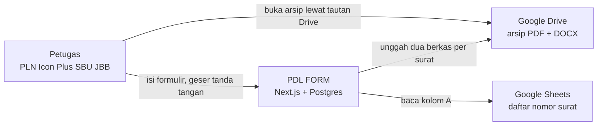
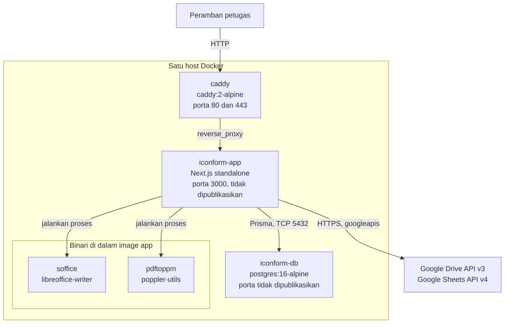
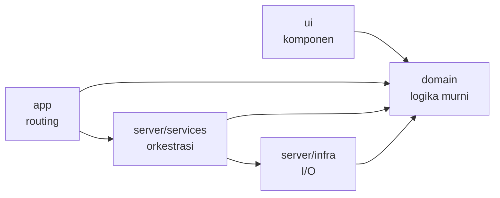
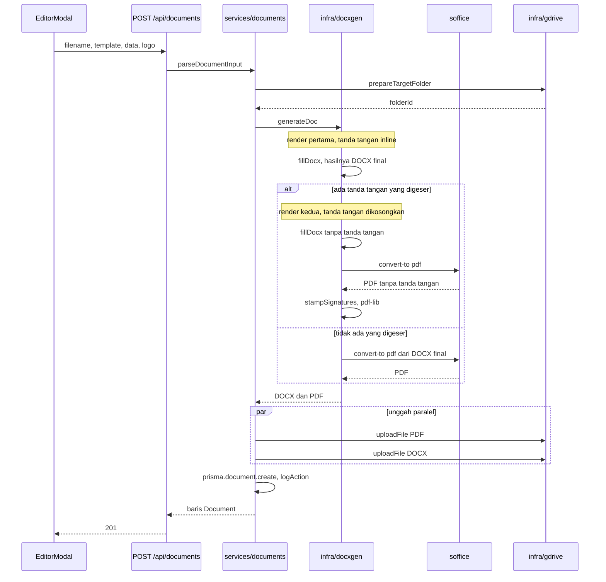
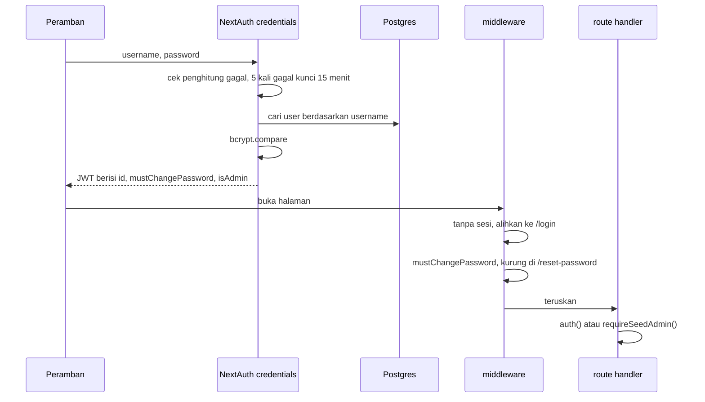

# Arsitektur

Dokumen ini menjelaskan bagaimana sistem disusun dan mengapa disusun begitu. Untuk
menjalankannya, baca [setup.md](setup.md). Untuk daftar endpoint beserta bentuk request
dan response-nya, baca [api.md](api.md).

---

## Apa yang dikerjakan sistem ini

Petugas mengisi formulir, sistem menghasilkan dua berkas dari master DOCX resmi (satu PDF
dan satu DOCX), mengunggah keduanya ke Google Drive, dan menyimpan metadatanya di
Postgres. Master DOCX-nya bukan hasil rekaan: berkasnya adalah dokumen resmi yang
placeholder-nya diganti tag `{namaBidang}`, sehingga tata letak hasil cetaknya sama dengan
surat yang sudah dipakai.



Postgres tidak menyimpan berkasnya, hanya metadata dan data formulirnya. Isi berkas hidup
di Drive. Konsekuensinya: kehilangan database berarti kehilangan indeks arsip, bukan
kehilangan suratnya.

---

## Container



Yang perlu diingat dari diagram ini: satu-satunya porta yang terbuka ke host adalah 80 dan
443 milik Caddy. Aplikasi dan Postgres tidak bisa dihubungi dari luar jaringan Docker. Itu
juga alasan alamat yang dibuka di peramban `http://localhost`, bukan `http://localhost:3000`.

Skema database diterapkan saat container menyala, bukan lewat berkas migration. Perintah
akhir di `Dockerfile` merantai tiga hal dengan `&&`:

```
prisma db push --accept-data-loss && node prisma/seed.cjs && node server.js
```

Rantai `&&` itu punya akibat yang mudah menjebak: seed yang gagal membuat server tidak
pernah menyala. Repo ini tidak punya folder `prisma/migrations`, jadi `prisma migrate
deploy` tidak akan bekerja.

---

## Lapisan di dalam src/

```
src/
├── app/          routing saja: halaman dan route handler
├── ui/           komponen React
│   ├── layout/
│   └── documents/
├── domain/       logika murni, tanpa I/O, aman dipakai peramban
├── server/
│   ├── auth.ts   konfigurasi NextAuth
│   ├── services/ orkestrasi kasus penggunaan
│   └── infra/    satu modul per sistem luar
└── types/        deklarasi tipe tambahan
```

Arah dependensinya satu arah dan tidak boleh dilanggar:



`domain` tidak mengimpor apa pun dari `server` atau `ui`, sehingga aman dipakai komponen
klien. `ui` tidak mengimpor `server`.

Aturan itu ditegakkan saat build, bukan lewat kesepakatan. Setiap berkas di
`src/server/**` dibuka dengan `import 'server-only'`. Kalau ada komponen klien yang
mengimpornya, `next build` gagal dengan pesan yang menyebut berkas pelanggarnya. Repo ini
tidak punya konfigurasi ESLint, jadi inilah satu-satunya penegak batas lapisan yang nyata.

Kenapa bukan monorepo frontend dan backend terpisah: Next.js App Router menjadikan
`src/app/` satu-satunya sumber routing, dan memang menempatkan halaman serta route handler
di pohon yang sama. Pemisahan literal berarti dua service, dua runtime, dua Dockerfile,
batas HTTP baru, dan memindahkan seluruh pipeline DOCX ke PDF. Pemisahan lapisan di dalam
`src/` memberi batas yang sama tanpa membongkar deploy.

### Peran tiap modul infra

| Modul | Sistem luar | Isi |
|---|---|---|
| `prisma.ts` | Postgres | singleton `PrismaClient`, di-cache secara global hanya di luar production |
| `gdrive.ts` | Google Drive API v3 | unggah, hapus, cari atau buat folder, ambil metadata, alirkan berkas |
| `sheets.ts` | Google Sheets API v4 | baca satu kolom daftar nomor surat |
| `docxgen.ts` | proses lokal `soffice` dan `pdftoppm` | isi template, konversi ke PDF, tempel tanda tangan, raster ke PNG |
| `audit.ts` | Postgres | catat tindakan ke tabel `AuditLog`; kegagalannya sengaja tidak fatal |

`gdrive.ts` membangun klien OAuth baru setiap operasi, bukan menyimpannya sebagai
singleton. Kredensialnya kredensial akun pengguna, bukan service account, karena service
account tidak punya kuota penyimpanan di akun Google non-Workspace.

### Lapisan service

`src/server/services/documents.ts` menampung orkestrasi yang dulu tersebar di route
handler. Yang diekspor:

| Fungsi | Tugas |
|---|---|
| `parseDocumentInput` | validasi nama berkas, template, dan logo; mengembalikan objek hasil, bukan melempar exception |
| `renderAndUpload` | siapkan folder Drive, hasilkan DOCX dan PDF, unggah keduanya paralel |
| `createDocument` | `renderAndUpload`, tulis baris DB, catat audit |
| `updateDocument` | `renderAndUpload`, perbarui baris, hapus dua berkas Drive lama |
| `deleteDocument` | tangani folder khusus BA Pengujian, hapus berkas, hapus baris |
| `rebuildDocument` | hasilkan ulang satu sisi pasangan DOCX dan PDF dari data formulir tersimpan |
| `renderPreview` | hasilkan pratinjau, berupa PDF utuh atau PNG per halaman |

Validasi mengembalikan `{ ok: false, error, status }` alih-alih melempar, supaya route
handler tetap yang memutuskan bentuk respons HTTP.

Dua hal sengaja ditinggal di route handler karena keputusan per-request, bukan kasus
penggunaan: pemeriksaan sesi dan pemeriksaan kepemilikan dokumen.

`createDocument` melakukan kompensasi kalau tulis DB gagal sesudah unggah berhasil: kedua
berkas Drive dihapus, supaya tidak ada berkas yatim yang tidak terindeks. `updateDocument`
memakai pola ganti, bukan versi: berkas baru diunggah, baris diperbarui, lalu dua berkas
lama dihapus.

---

## Model data

```mermaid
erDiagram
    User ||--o{ Document : "membuat"
    User ||--o{ Session : "punya"
    User ||--o{ User : "memprovisikan"

    User {
        String id PK
        String username UK
        String email UK "nullable"
        String passwordHash
        String name
        Boolean mustChangePassword
        DateTime createdAt
        String createdById FK "null pada admin seed"
    }
    Document {
        String id PK
        String filename
        FolderType folder
        TemplateType template
        String contentHtml "sebenarnya JSON data formulir"
        String logoBase64 "nullable"
        String driveFileIdPdf
        String driveFileIdDocx
        String webViewLinkPdf
        String webViewLinkDocx
        DateTime createdAt "tanggal surat, bukan waktu dibuat"
        DateTime updatedAt
        String createdById FK
    }
    AuditLog {
        String id PK
        String action
        String target
        String actorId "snapshot"
        String actorName "snapshot"
        DateTime createdAt
    }
    Session {
        String id PK
        String sessionToken UK
        String userId FK
        DateTime expires
    }
```



Tiga keputusan yang tidak terbaca dari nama kolomnya.

`Document.contentHtml` menyimpan `JSON.stringify(data)`, yaitu seluruh isi formulir.
Namanya warisan dari rancangan lama yang menghasilkan HTML di sisi klien. Kolom inilah yang
memungkinkan unduhan menghasilkan ulang berkas alih-alih mengambil dari Drive.

`Document.createdAt` diisi tanggal surat itu sendiri, bukan waktu barisnya dibuat. Fungsi
`archiveDateOf()` di `src/domain/templates.ts` mengambilnya dari bidang tanggal milik
template. Akibatnya arsip bulanan mengikuti tanggal surat, dan mengubah tanggal surat ikut
memindahkan letak arsipnya.

`AuditLog` menyimpan `actorId` dan `actorName` sebagai snapshot, bukan relasi. Entrinya
harus tetap terbaca setelah akun pelakunya dihapus.

`Session` tidak terpakai. Strategi sesinya JWT, jadi tabel ini ada hanya karena bentuk
adapter Auth.js.

---

## Pipeline dokumen

Ini bagian yang paling penting dipahami sebelum menyentuh `docxgen.ts`, karena
perilakunya tidak bisa disimpulkan dari nama fungsinya.

DOCX dan PDF tidak dihasilkan dari satu render yang sama. DOCX selalu menyimpan tanda
tangan, stempel, dan logo secara inline di tempat tag-nya berada di template, dan
**sengaja mengabaikan posisi geser**. PDF sebaliknya: dihasilkan dari render kedua yang
tanda tangannya dikosongkan, lalu gambarnya ditempel `pdf-lib` di koordinat hasil geseran.

Alasannya: Word menata isi dokumen sekitar 50 pt lebih rapat daripada LibreOffice. Satu
koordinat absolut tidak mungkin benar di kedua program sekaligus, jadi DOCX memakai posisi
relatif milik template dan PDF memakai posisi absolut hasil geseran.



Jadi menyimpan satu surat dengan tanda tangan yang digeser menjalankan `fillDocx` dua kali
dan `soffice` sekali. Tanpa geseran, `fillDocx` sekali.

### Rincian di dalam fillDocx

1. Baca master dari `templates/docx/<berkas>` lewat PizZip.
2. Isi tag dengan docxtemplater. `nullGetter` mengganti bidang kosong dengan
   `......................`, kecuali tag gambar yang diganti string kosong.
3. Kembangkan data warisan jadi bentuk loop: `material1..5` jadi `items[]`,
   `kendala1..3` jadi `kendala[]`, `nama1..3` jadi `petugas[]`.
4. Setiap bidang non-meta yang kosong diganti string titik-titik. Bidang meta yang
   dilewati: berawalan `_`, berakhiran `Pos` atau `Size`, atau nama tanda tangan.
5. Render.
6. Sunting XML mentah pada `word/document.xml` serta seluruh `header*.xml` dan
   `footer*.xml`:
   - `floatMarks()` mengubah setiap `<wp:inline>` jadi `<wp:anchor>` dengan `<wp:wrapNone/>`,
     supaya gambar tanda tangan tidak menambah tinggi baris. Beberapa tanda tangan dalam
     satu paragraf digeser berurutan sesuai lebar tetangganya.
   - `ensureWpNs()` menyisipkan deklarasi namespace `wp:` kalau ada elemen `<wp:` tanpa
     deklarasinya. Tanpa ini Word menolak membuka berkasnya, sementara LibreOffice tetap
     mau, sehingga cacatnya hanya muncul di Word.

Kedua transformasi itu berlaku di header dan footer, bukan hanya di badan dokumen. Logo
mitra BA Pengujian bergantung pada hal ini.

### Dua binari yang dipanggil

| Binari | Argumen | Batas waktu | Catatan |
|---|---|---|---|
| `soffice` | `--headless --convert-to pdf --outdir <dir> <berkas>` | 60 detik | dijalankan dengan `HOME` diarahkan ke direktori temporer per panggilan, supaya profil LibreOffice tidak bertabrakan dan konversi paralel tetap aman |
| `pdftoppm` | `-png -r 96 <berkas> <prefiks>` | 60 detik | hanya dipakai pratinjau. Hasilnya diurutkan leksikografis, benar sampai sembilan halaman |

Direktori temporernya dibuat dengan `mkdtemp` dan dibuang di blok `finally`.

---

## Tata letak folder Drive

`resolveFolderId(templateId, folder)` mengembalikan `perTemplate[templateId] ??
perFolder[folder]`. Variabel per template menang, variabel per jenis folder jadi
penampung. Tabel lengkapnya ada di [setup.md](setup.md) langkah 7.

BA Pengujian satu-satunya yang diperlakukan khusus. `prepareTargetFolder()` mencari atau
membuat subfolder bernama sama dengan nama berkasnya di bawah folder induk BA Pengujian,
lalu mengunggah logo mitra ke dalamnya sebagai `logo.<ekstensi>`:

```
Folder BA Pengujian/
└── BA_Pengujian_050602-SKU-008/
    ├── BA_Pengujian_050602-SKU-008.pdf
    ├── BA_Pengujian_050602-SKU-008.docx
    └── logo.png
```

Penghapusan mengikuti bentuk itu: `deleteDocument()` menelusuri induk dari berkas PDF, dan
kalau nama induknya sama dengan nama berkas dokumen, seluruh folder dihapus. Kalau tidak
cocok, ia jatuh ke penghapusan dua berkas satu per satu. Pemeriksaan nama itu yang mencegah
folder induk ikut terhapus kalau strukturnya di luar dugaan.

Pencarian folder tidak memakai lock. Dua penyimpanan bersamaan bisa membuat dua folder
bernama sama. Untuk aplikasi satu pengguna hal ini diterima.

---

## Sesi dan hak akses



Tidak ada kolom role. Admin ditentukan secara struktural: pemegang `createdById === null`,
yaitu akun hasil seed. Setiap akun yang dibuat lewat antarmuka mendapat `createdById`
berisi id admin, jadi hanya ada satu admin selamanya. `requireSeedAdmin()` di
`src/server/services/users.ts` yang memeriksanya, dan flag yang sama ikut di JWT sebagai
`isAdmin`.

`mustChangePassword` memaksa ganti password saat login pertama. Middleware mengurung
pemakainya di `/reset-password` untuk semua navigasi halaman, tapi **tidak** untuk jalur
`/api`. Pengecualian itu disengaja: mengalihkan sebuah `fetch` ke halaman HTML akan
merusak parsing JSON-nya. Route API menjaga dirinya sendiri.

Sesi berumur 8 jam, strateginya JWT, jadi tidak ada state sesi di server. Middleware
menjalankan instance NextAuth kedua dengan `providers: []` supaya kompatibel dengan runtime
edge, yang tidak bisa memuat bcryptjs.

Pembatas laju login disimpan di `Map` dalam memori proses. Angkanya hilang saat restart dan
hanya benar untuk satu instance. Kalau nanti ada lebih dari satu replika, ini harus
dipindah ke Redis.

Header keamanan di `next.config.ts`: `X-Frame-Options: DENY`,
`X-Content-Type-Options: nosniff`, dan `Referrer-Policy: strict-origin-when-cross-origin`.
Tidak ada Content Security Policy.

---

## Hal-hal yang akan membingungkan pembaca berikutnya

Empat keanehan yang nyata di kode sekarang, ditulis di sini supaya tidak perlu ditemukan
lagi lewat penelusuran.

**`Document.contentHtml` bukan HTML.** Isinya JSON data formulir. Nama kolomnya warisan.

**`NODIN` ada separuh.** Ia masih anggota enum `TemplateType` di skema, masih punya berkas
`templates/docx/NODIN.docx`, masih punya `GDRIVE_FOLDER_NODIN_ID` yang dibaca `gdrive.ts`,
dan masih punya kode pengembangan bidang di `docxgen.ts`. Tapi ia tidak punya `TemplateDef`
di `src/domain/templates.ts`, sehingga tidak muncul di sidebar dan ditolak dengan
`400 invalid template` kalau dikirim langsung ke API. Yang hidup tujuh template, bukan
delapan.

**Kolom `Session` tidak dipakai** karena strategi JWT, seperti dijelaskan di bagian model
data.

**Pembatas laju login hanya benar untuk satu instance**, seperti dijelaskan di bagian sesi.

---

## Master DOCX dan skrip pembedahnya

`templates/docx/` berisi tujuh master. Berkasnya harus tetap di sana: `docxgen.ts`
menyelesaikan path lewat `process.cwd()/templates/docx`, dan `Dockerfile` menyalin folder
itu ke image.

Folder `scripts/` berisi sekitar empat puluh skrip Python yang membedah OOXML master
tersebut. Mayoritasnya operasi sekali pakai dari putaran revisi klien, bukan kode aplikasi.
Yang masih relevan dan aman dijalankan ulang dijelaskan di [operations.md](operations.md).
